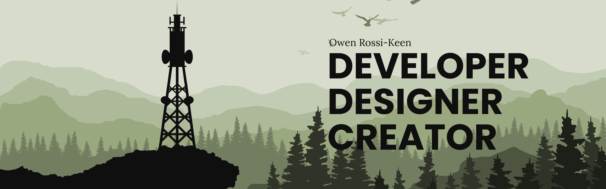

             
## About Me
I'm Owen Rossi-Keen, a full-stack web developer, designer, and technology enthusiast living in the old steel town of Aliquippa, Pennsylvania. After spending my early life exploring the internet, I decided to take a crack at web development myself. Now, with several years of experience, I've transformed that original curiosity into a career.   
I specialize in designing engaging web experiences for organizations with unique identities. There's nothing more disappointing than a boring website, and I've dedicated myself to building sites that captivate the user and truly reflect the excellence of the groups and individuals I work with.   
## My Skills

   

## Projects

      

      

          

      
